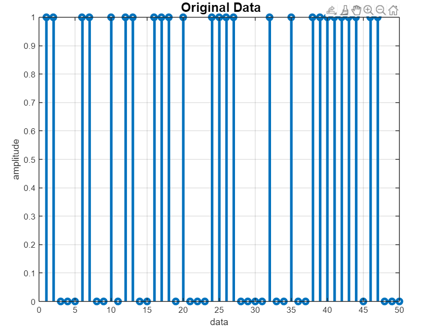

# QPSK-modulation-and-demodulation
This is Matlab implementation of communication through QPSK(Quadrature  Phase Shift Keying) signals which include the modulation and demodulation of it, and make it more realistic we have added white Gaussian noise into it.

## Here is the visualzation of the input data
We have passed a string which is: 

