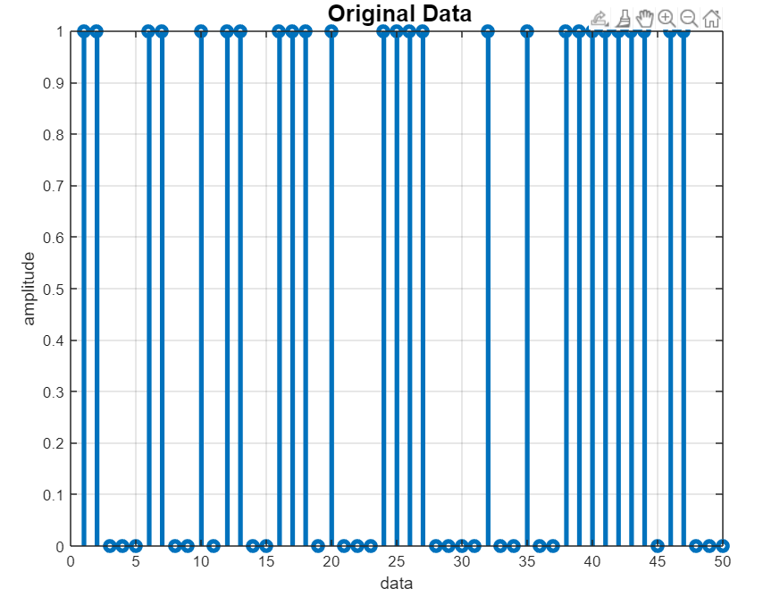
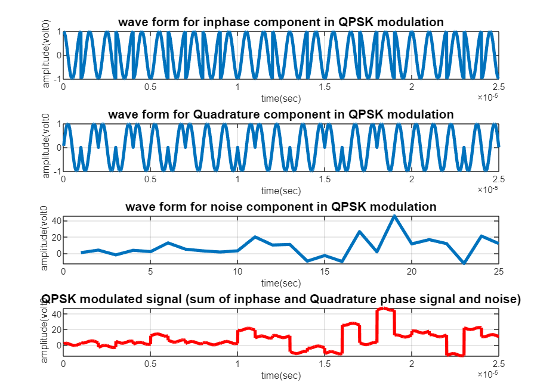
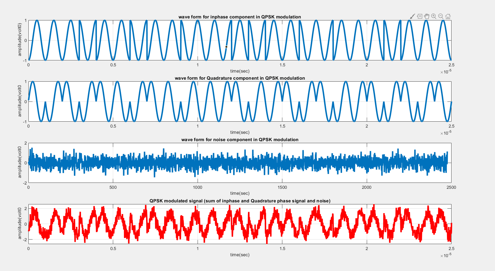
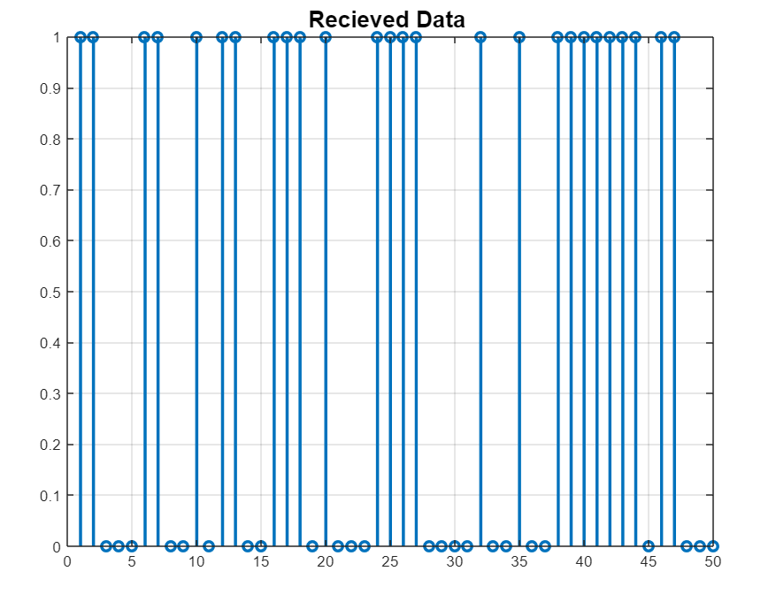

# QPSK-modulation-and-demodulation
This is Matlab implementation of communication through QPSK(Quadrature  Phase Shift Keying) signals which include the modulation and demodulation of it, and make it more realistic we have added white Gaussian noise into it.

- If you have **communcation pack** installed in the **matlab** then use: **modulation_demodulation_QPSK.m**
- else use this one: **modulation_demodulation_QPSK_without_communication_pack.m**

## Here is the visualization of the input data
We have passed a string which is randomly genrated.

## Here is the visualization of the modulating signal contaning AWGN(white gaussian noise).

## Here is the visualization of the modulating signal contaning different kind of noise.

## Here is the visualization of the Recieved data.

## Acknowledgement
- [Prof.Ashok Ranade](https://ahduni.edu.in/seas/people/faculty/ashok-ranade) for the guidence for this project.
- [Tayab Memon](https://www.researchgate.net/publication/224440315_Quadrature_Phase_Shift_Keying_modulator_demodulator_for_Wireless_Modem) for reaserch paper which we used as reference.
